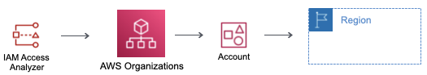

# fixiam

Stack must be deployed in the root management account or better yet a new account that has had the delegated administrator for IAM Access Analyzer assigned.

In all active regions, an ```ACCOUNT``` and ```ORGANIZATION``` boundary analyzer is deployed for monitoring of Identity Access Management (IAM) findings.



IAM Access Analyzer is not currently supported in the following regions.

- ap-south-2
- eu-central-2
- eu-south-2
- me-central-1
